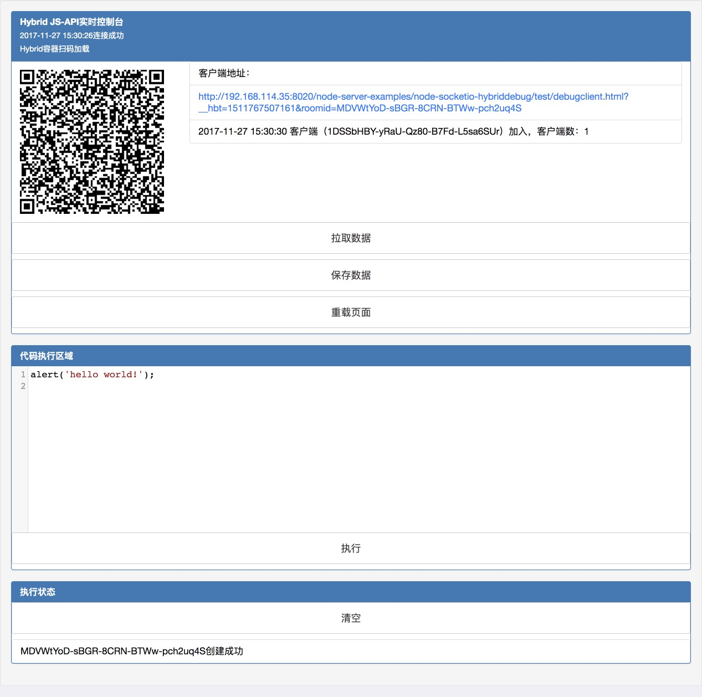
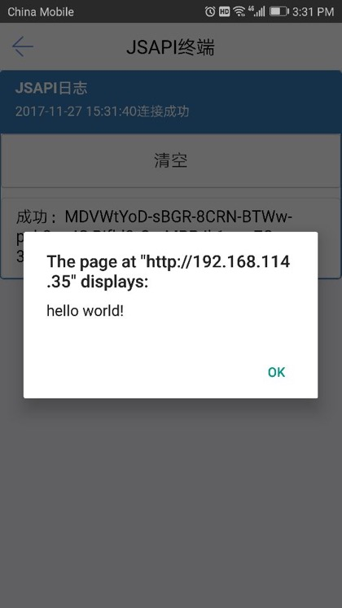

# node-socketio-hybriddebug

基于socket.io实现的hybrid模式手机调试页面，pc编辑代码，发送到hybrid手机端执行

运行步骤：

1.`npm install`

2.`npm run serve`启动`node`服务

3.浏览器打开`./test/debugroom.html`页面

4.开始测试（浏览器直接打开或手机扫码）

注意，手机端链接请确保在同一个网段

## 截图

